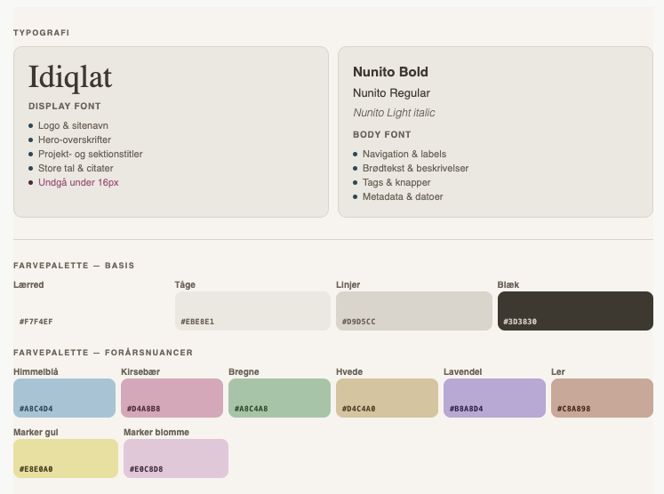
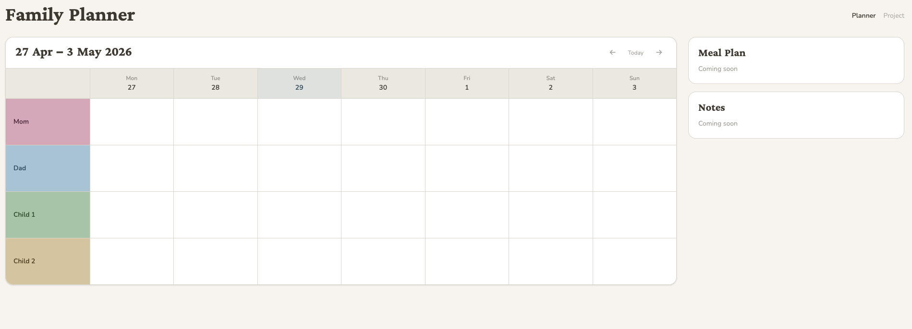

# Family Planner

A digital take on the wall planning boards popular in Danish homes — a shared, at-a-glance overview of the whole family's week, built for a large screen.

> This project is a personal portfolio piece built to demonstrate frontend development skills in React and Tailwind CSS.

---

## Screenshots




---

## Features

### Currently available
- Weekly calendar showing the current week with date-based navigation (previous/next week)
- Events tied to specific dates — not recurring weekly
- Add, edit and delete events with title, time, emoji icon, assigned members and notes
- Events displayed in chronological order within each day
- Assign an event to multiple family members at once — it appears in all their rows
- Note indicator on events that have a description
- Color-coded rows for each family member
- Today's date highlighted in the calendar
- Clean, paper-inspired design with a warm color palette

### Planned
- [ ] Configurable start day of the week (Monday or Sunday)
- [ ] Dynamic family members — add or remove members as needed
- [ ] Meal planning section
- [ ] Notes section
- [ ] Resizable sections — let each family customize the layout
- [ ] Monthly overview

---

## Tech stack

- [React 19](https://react.dev/)
- [Vite](https://vite.dev/)
- [Tailwind CSS v4](https://tailwindcss.com/)
- [React Router v7](https://reactrouter.com/)

---

## Getting started

```bash
# Install dependencies
npm install

# Start development server
npm run dev

# Build for production
npm run build
```

---

## Design

The visual design is inspired by the physical wall planning boards commonly found in Danish homes. The goal is a calm, paper-like aesthetic that feels familiar and easy to read at a glance — warm off-white backgrounds, soft color accents per family member, and clear typographic hierarchy using a display serif paired with a rounded sans-serif.

---

## Background

I built this project to have something concrete to show during my job search — a real-world app that solves an actual problem rather than a tutorial clone. The scope is intentionally kept small for the initial proof of concept, with a clear roadmap for expanding it.

## AI assistance

Parts of this project were built with help from Claude (Anthropic) as a pair-programming tool.

AI was used for:
- Setting up Tailwind CSS v4 with Vite
- Scaffolding the initial component structure and layout
- Building the event system (localStorage, modals, multi-member support)
- Implementing date-based week navigation

All feature decisions, design direction, and visual choices were made by me.
The code has been read, understood, and approved before being committed.
